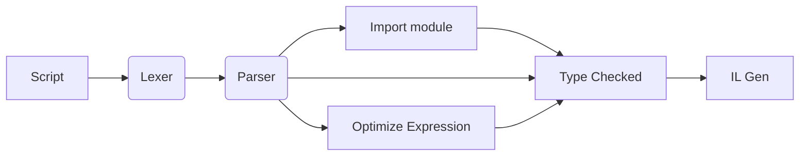
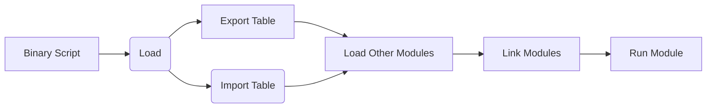

# AuroraScript 
Strongly typed script imitating `typescript` 

What is AuroraScript?
--------------
The positioning of AuroraScript is a strongly typed script, using TypeScript-like syntax,
and the goal is to use the stack virtual machine to run 


Compiler WorkFlow 
--------------


Virtual Machine WorkFlow 
--------------



Development Progress  
--------------
- [x] Lexical Analyzer
- [x] Parser Syntax Tree 
- [x] Array Support
- [x] Custom Type Define
- [x] String Escape & format
- [x] Cast Type
- [x] Object Constructor && ~
- [ ] Custom Type Support
- [ ] Parser Scope Tree
- [ ] Optimize Syntax Tree 
- [ ] IL Generation 
- [ ] Virtual Machine


Script Basic Typed
--------------
* `int`     32-bit integer  
* `long`    64-bit integer  
* `float`   32-bit float 
* `double`  64-bit float 
* `short`   16-bit integer   
* `byte`     8-bit integer    
* `string`  string    
* `boolean` true false    
* `null`    null value     
* `array`   typed array value  


Script Keys
--------------
* `function` define function  
    ``` typescript
    function log(message: string): void {
        console.log(message);
    }
    log('hello world!');
    ```
* `declare` [`fcuntion`] declare external function  
    ``` typescript
    declare function log(message: string): void;
    log('hello world!');
    ```
* `import`  import other scripts or declare external scripts Keys  
    ``` typescript
    // import into the current script space 
    import 'common';
    // import into the current script and specify the namespace 
    import $namespace from 'common';
    ```
* `const`  declare immutable constants  
    ``` typescript
    // can't be changed 
    const PI: double = 3.1415926;
    ```
* `var`  declare variable  
    ``` typescript
    var i: int = 100;
    i++;
    console.log(i);
    ```
* `type` define typed  
    ``` typescript
    type IntArray = int[];
    var array: IntArray = [];
    ```
* `enum`  declare enum type  
    ``` typescript
    enum Animals {
        Wolf = 1,
        Dog , // Dog = 2
        Tiger = 3
    };
    ```
* `export` [`function|type|var|const|enum`] expose the internal objects of the script, When the export keyword is not used, it is declared as an internal object by default
    ``` typescript
    export function log(message: string):void{
        console.log(message);
    }
    export type IntArray = int[];
    export var  i: int = 100;
    export const PI: double = 3.1415926;
    export enum Animals {
        Wolf = 1,
        Dog , // Dog = 2
        Tiger = 3
    };
    ```
* `typeof` get object typed  
    ``` typescript
    export const PI: double = 3.1415926;
    console.log(typeof PI);
    ```
* `for` loop statement `break`、`continue`  
    ``` typescript
    for(var i = 0; i < 10 ; i++){
        if(i < 5) continue;
        if(i == 9) break;
        console.log(i);
    }
    ```
* `if` conditional statement `else`、`else if`  
    ``` typescript
    if(exp == null){
    }else if(exp == 1){
    }else{
    }
    ```
* `return` retuen a value 
    ``` typescript
    // return multiple return values 
    function tupleFunction(id: number): [number, string] {
        return [id, id.toString()];
    }
    // return one return values 
    function tupleFunction(id: number): number {
        return id;
    }
    ```


Script Multiple return values (Unrealized)
--------------
``` typescript
export function tupleFunction(id: number): [number, string] {
    return [12, ''];
}
```


Script Example
--------------


``` typescript
/**
 * aurora script
 * */
/* external declare */
import 'common';

/* import reference module */
import Test from 'test';

/**
 * declare external Enum
 */
declare enum Animals {
    Wolf = 1,
    Dog = 2,
    Tiger = 3
};


/** declare external const var */
declare const fff: number = 0x1234;

/**
 * declare external function
 * print message to console
 * @param message
 */
declare function print(message: string): void;

/**
 * declare external function
 * read text file content
 * @param fileName
 */
declare function ReadFile(fileName: string): string;

/* exported  attributes */
export var length = 100;

/**
 * exported function Multiple return values
 * @param id
 */
export function tupleFunction(id: number): [number, string] {
    return;//[12, ''];
}

/**
 * internal function
 */
function fo(): number {
    return 3.1415926;
}


const text = Number.parseInt(`0`).toFixed(3 * 0.5) + 'end';

var floatNumber = window.setInterval(fo, 123);

floatNumber = 5 + 3 * 6;

floatNumber += 123;


var n1 = 33 * 25 + 55 * 33 + 55;
var n2 = 33 + 25 - 55 * 33 / 55;
var n3 = (n1 += 33) * 3;
var n4 = 55 + -n2;
var n5 = 111 * (22 * 33);
var typeName: string = typeof true;
var TRUE = true;
var FALSE = !TRUE;

var ff: number = 0;


var fov = fo();


for (var l = 0; i < 100; i++) fov++;


var c, d, r = (
    33 + 66)
    /
    add(
        10 *
        (
            10 + 20)
        , // max
        50 + Math.max(
            5, 32 * 0.5
        ) / 20)
    + 3.1415 * 52;


// comment
var len = 50;
var fd = 15 + 25 *
    55 + 33 * 55 + 22;
var os = 25 + 15 *
    (15 + len);
var ls = add(0x55, 0x33) / 2;
var px = len * (-len + add(0x22 + (33 + 0x5), 0xff)) / (6 + 5);

console.log(c + d + r);

/**
 *          
 * 
 * @param cmd
 */
export function main(cmd:            /* 
 * block comment */string): void {
    console.log('hello wrold!');
}

function add(a: number, b: number): number {
    return a + b;
}

function foo(fs: number, name: string): boolean {
    if (fs && name && fs > 100) {
        return true;
    } else {
        return false;
    }
}

for (var i = 0; i < 100; i++) {
    if (i == 66) break;
    if (i > 33 && i < 55)
        continue;
    else
        console.log(i);
}

var nil;
var str = `
this is line 1
this is line 2
this is line 3`;
var str2 = "abc";
var str3 = '123';
var num = 0xff023;
var bol = true;
// var ary1 = [];
// var ary2 = [1, 2, 3];
var bol1 = bol == null;
var bol2 = bol1 == false;
var bol3 = !bol;
var age = 22;
var v = -age + 1.5 - 0x36 * 2.5 / 1.2;
v += 35;
var n = 'hello';
var result = foo(v, n);
console.log(result);
main('yoyo');
// console.log(ary2[1]);
```


@AstExplorer 
https://astexplorer.net/